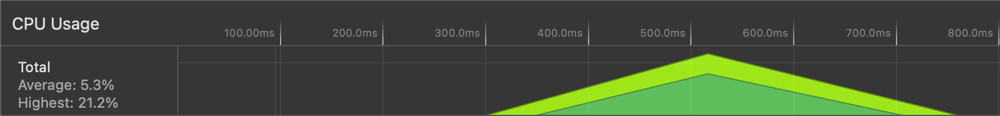
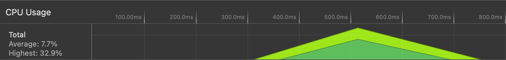

## Purpose

This repo contains two projects one uses web standards css, and other uses a popular css-in-js framework emotion-css.

The goal is to identify the performance impact between the two methods.

## Approach

Using create-react-app I created the two identical projects, and added emotion-css to one of them.

Both of the projects contain one component rendered **1000** times with the exact same styles.

We will create production builds of the two projects and serve them locally in Safari and Chrome to monitor the performance tab, and try to extract some numbers.

The device used to run the project is **Macbook Pro 16" - 2019 - 32GB Ram - 2.6 6-Core i7**

## Results

TLDR; Emotion css consumes more cpu power and increases the duration of document load timeline i.e. First Paint, onLoad event, etc.

### CPU

Emotion build scored 32.9% CPU usage while native css build scored 21.2%

**CSS - 21.2%**

**Emotion - 32.9%**

### Memory HEAP

Emotion build scored 13.8 MB HEAP memory consumption while native css build scored 12.7 MB

**CSS - 12.7 MB**

**Emotion - 13.8 MB**

### onLoad event

Emotion build onLoad event was fired after 254.6 ms while in the native css build it was fired after 229.4 ms

**CSS - 229.4 ms**

**Emotion - 254.6 ms**

